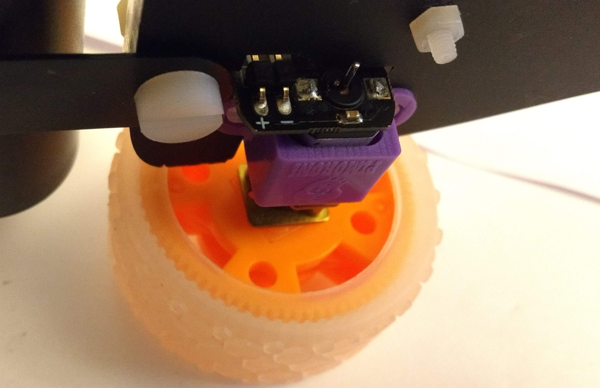
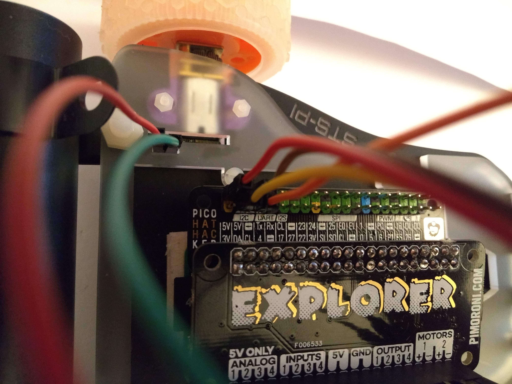
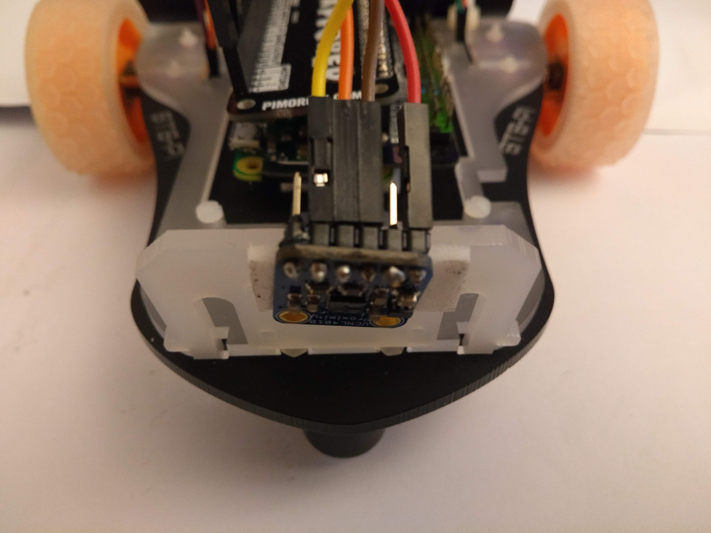

# Moon buggy robot with proximity detection

Code and instructions for moon buggy robot with proximity detection.

## You will need

Equipment:

- [STS Pi robot](https://shop.pimoroni.com/products/sts-pi)
- [Raspberry Pi Zero](https://shop.pimoroni.com/products/raspberry-pi-zero) or [Pi Zero W](https://shop.pimoroni.com/products/raspberry-pi-zero-w)
- [Explorer pHAT](https://shop.pimoroni.com/products/explorer-phat)
- [Pico HAT Hacker](https://shop.pimoroni.com/products/pico-hat-hacker)
- 2x [male 2x20 GPIO header](https://shop.pimoroni.com/products/colour-coded-gpio-headers)
- [Male--to--female jumper jerky](https://shop.pimoroni.com/products/jumper-jerky-junior?variant=1076482177)
- [Female--to--female jumper jerky](https://shop.pimoroni.com/products/jumper-jerky-junior?variant=1076482185)
- [Proximity sensor](https://shop.pimoroni.com/products/vcnl4010-proximity-light-sensor)
- USB cylindrical battery (I got the [cheapest one from Amazon I could find](https://www.amazon.co.uk/gp/product/B07KY63Z3R/ref=ppx_yo_dt_b_asin_title_o00_s00?ie=UTF8&psc=1))
- Micro SD card

Tools:

- Soldering iron (or get solderless equivalent headers)
- Flat--tip screwdriver
- [Anti--static wrist strap](https://shop.pimoroni.com/products/anti-static-wrist-strap) (optional but recommended)
- [Double--sided adhesive pads](https://www.amazon.co.uk/Sellotape-Permanent-Double-Sided-Sticky/dp/B004OHT7LS/ref=sxbs_bbp_recs_sx_w_p_v1?keywords=adhesive+pads&pd_rd_i=B004OHT7LS&pd_rd_r=20044f5f-d219-4ed1-9727-8bbff4120d2b&pd_rd_w=4boMm&pd_rd_wg=e2PTD&pf_rd_p=e6692ec6-496f-4aae-9035-49021365f38d&pf_rd_r=439N9P4EHGCF90QT6NBB&qid=1572294758) or similar for mounting

Notes:

- I suggest the wrist strap because the Raspberry Pi seems to be more sensitive to static shocks than regular computer hardware and I've fried a couple of (quite expensive) camera modules and my Pi Zero's WiFi module.
Proceed without a static strap at your own risk.
- You need to connect to your raspberry pi from another computer, so if you opt for a Pi Zero without wifi you will also need to connect to your router with a network cable and a [micro USB to ethernet adaptor](https://shop.pimoroni.com/products/three-port-usb-hub-with-ethernet-and-microb-connector).

## Hardware setup

1. Solder a male header to your Pi Zero as normal
1. Solder a male header to the **OUTSIDE** of the Pico HAT Hacker (see photos)
1. Place the Pico HAT Hacker on the Pi Zero header and solder in place. Be sparing with the solder to allow enough room for the Explorer pHAT to attach.

1. Solder the headers to the Explorer pHAT (ensuring the double row of headers faces **DOWN**)

1. Fit the Explorer pHAT to the GPIO pins as normal and press down firmly for a snug fit.

1. Solder the header to the proximity sensor
1. Set up the STS robot chassis following the instructions given, or have a look at the [build video](https://youtu.be/jHn3ZiPG69w)
1. Stick the proximity sensor to the camera mount and install the mount on the STS chassis
1. Mount the assembled pi zero to the chassis (I just used the double--sided adhesive pads)

## Wiring

1. The two motors are labelled on the chassis. Wire motor one to (you've guessed it) `Motors 1` on the explorer pHAT, and motor two to `Motors 2`, using the male--to--female jumper jerky. The polarity is indicated on the bottom of the motors. I tend to use red wires for `+` and whatever other colour I have for `-`.

1. Now using female--to--female jumper jerky wire the sensor to the Pico HAT Hacker header.
    1. `Vin` is `+` and goes to pin `2` or `4` (one of the red pins)
    1. `GND` is ground and goes to pin `6` (black)
    1. `SDA` goes to pin `3` (labelled `DA`)
    1. `SCL` goes to pin `5` (labelled `CL`)

You can use this [explorer pHAT pinout to help](https://pinout.xyz/pinout/explorer_phat).
In the following images:

- red is `5V`/`Vin`
- brown is `Ground`/`GND`
- yellow is `DA`/`SDA`
- orange is `CL`/`SCL`

## Software

1. [Etch Raspbian](https://www.raspberrypi.org/downloads/raspbian/) to your SD card. We're going to be working headless (i.e. no keyboard and monitor) so you can use Raspbian Lite.
1. Connect your Pi to your network.
    1. If you're using a Zero W you can [follow this guide to connect to your wifi and enable ssh](https://www.raspberrypi-spy.co.uk/2017/04/manually-setting-up-pi-wifi-using-wpa_supplicant-conf/)
    1. If you're using a non--W Zero you can connect your network adaptor to the pi via your micro--USB to ethernet adaptor
    1. Either way, you need to enable ssh by creating a blank file called `ssh` in the `boot` partition
1. Turn on your Pi and ssh in. Open a terminal (or terminal emulator) and type in `ssh pi@192.168.xxx.xxx` (you can get the full ip address from your network router's 'devices' page) and enter the password (default `raspberry`)
1. You may need to [install pip3](https://www.raspberrypi.org/documentation/linux/software/python.md): `sudo apt install python3-pip`
1. Install the [explorer library from Pimoroni](https://github.com/pimoroni/explorer-hat): `curl https://get.pimoroni.com/explorerhat | bash`
1. Install the [VCNL4010 library](https://learn.adafruit.com/using-vcnl4010-proximity-sensor/python-circuitpython): `sudo pip3 install adafruit-circuitpython-vcnl4010`
1. Download the `test-sensor.py` script to your robot: `wget https://raw.githubusercontent.com/philmikejones/proximity-robot/master/test-sensor.py`
1. Download `robot.py` to your pi, which is the final script to control the robot: `wget https://raw.githubusercontent.com/philmikejones/proximity-robot/master/robot.py`

## Calibrate sensor

1. Run the sensor calibration script with `python3 test-sensor.py`. This should continually output integer values. Wave your hand in front of the sensor about 200mm and see how the value printed out changes. This is your threshold for when the robot should trigger evasive manoeuvres! On mine this was about 2500. When you're happy with the value you need, cancel this script with `CTRL` + `c`.
1. Edit robot.py with `nano robot.py`.
1. Edit the `if sensor.proximity < 2500:` and `elif sensor.proximity > 2501:` lines and replace the `2500` with the threshold you determined above.
1. While you have this file open you can also edit the steps the robot takes to avoid obstacles. These are the lines under `elif sensor.proximity > 2501:`. I have just set the robot to back up a bit and turn for now.
1. Close with `CTRL` + `x`, `y`

## Run on startup

1. Make it so your pi can execute this on startup with: `chmod +x robot.py`
1. Set up your pi to start this script on reboot by entering `crontab -e`
1. You might need to choose an editor; I recommend nano
1. Add `@reboot /home/pi/robot.py` to the bottom of this file
1. Close and save (`CTRL` + `x`, `y`). If you're successful you should see `crontab: installing new crontab`
1. Shutdown your pi: `sudo shutdown -H now`
1. When it turns off, disconnect the micro--usb network cable and the power supply
1. Make sure it's mounted to the STS robot chassis and attach the wheels
1. Plug in your battery and, after about 30 seconds or so, off it goes

## Troubleshooting

- If your robot turns on the spot when it starts up, work out which motor is moving backwards and uncomment the appropriate line at the top of the `robot.py` script to invert that motor. You will need to disconnect the power and reconnect via network. You'll probably want to unplug the motor cables while you're working on it.
- If your robot goes backwards when it starts up, invert both motors by uncommenting both lines.
