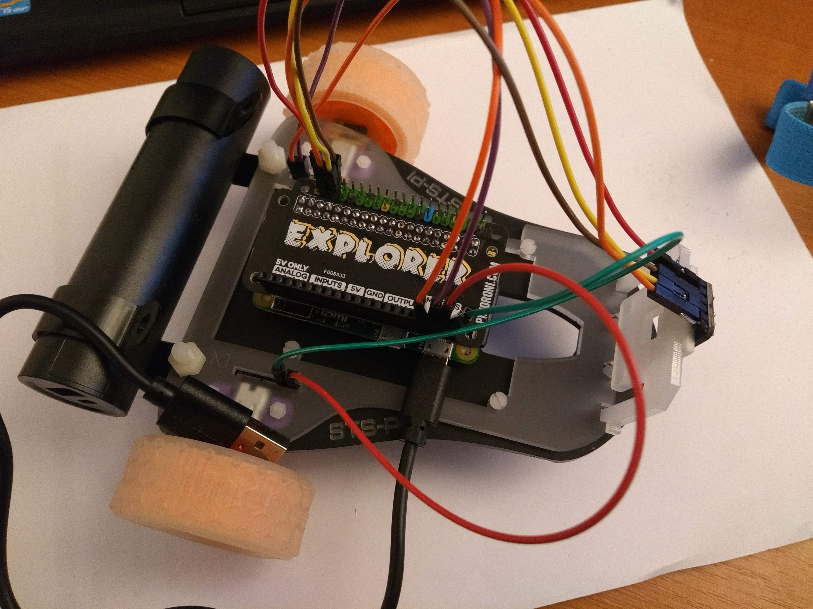
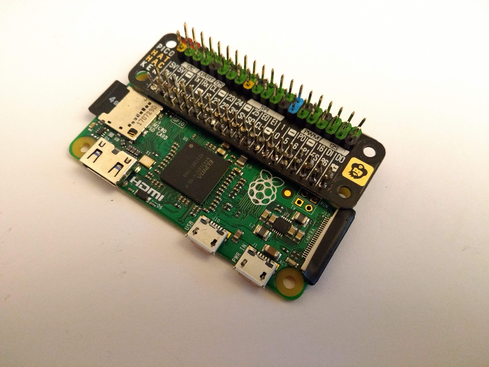
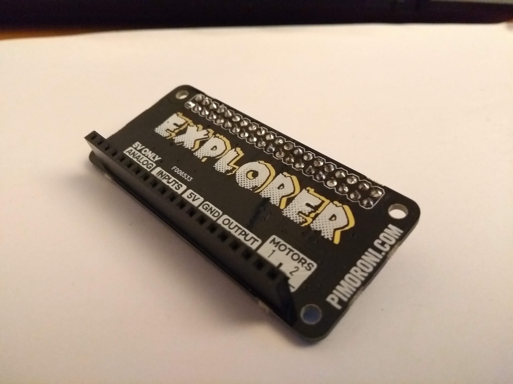
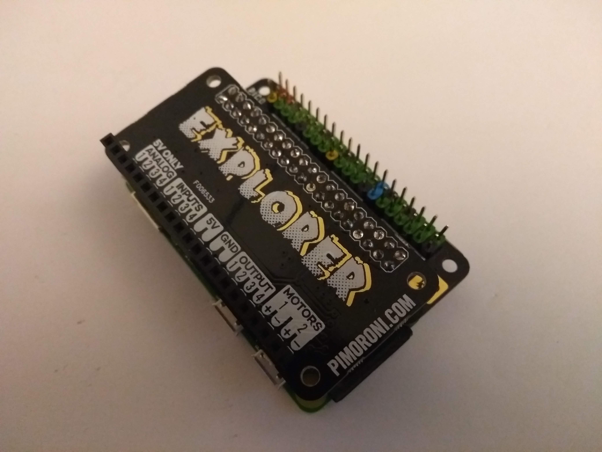
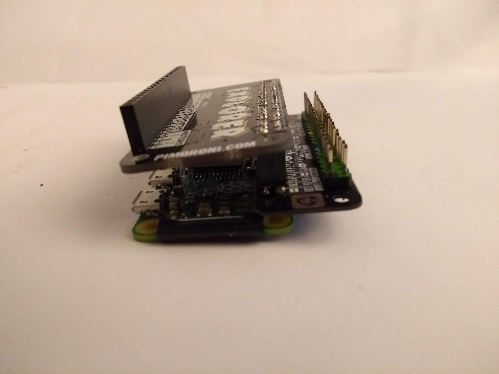

# Moon buggy robot with proximity detection

Code and instructions for moon buggy robot with proximity detection.

## You will need

Equipment:

- [STS Pi robot](https://shop.pimoroni.com/products/sts-pi)
- [Raspberry Pi Zero](https://shop.pimoroni.com/products/raspberry-pi-zero) or [Pi Zero W](https://shop.pimoroni.com/products/raspberry-pi-zero-w)
- [Explorer pHAT](https://shop.pimoroni.com/products/explorer-phat)
- [Pico HAT Hacker](https://shop.pimoroni.com/products/pico-hat-hacker)
- 2x [male 2x20 GPIO header](https://shop.pimoroni.com/products/colour-coded-gpio-headers)
- [Male--to--female jumper jerky](https://shop.pimoroni.com/products/jumper-jerky-junior?variant=1076482177)
- [Female--to--female jumper jerky](https://shop.pimoroni.com/products/jumper-jerky-junior?variant=1076482185)
- [Proximity sensor](https://shop.pimoroni.com/products/adafruit-vcnl4040-proximity-and-lux-sensor-stemma-qt)
- [USB battery](https://www.amazon.co.uk/gp/product/B07KY63Z3R/ref=ppx_yo_dt_b_asin_title_o00_s00?ie=UTF8&psc=1)
- Micro SD card

Tools:

- Soldering iron (or get solderless equivalent headers)
- Flat--tip screwdriver
- [Anti--static wrist strap](https://shop.pimoroni.com/products/anti-static-wrist-strap) (optional but recommended)

Notes:

- I suggest the wrist strap because the Raspberry Pi seems to be more sensitive to static shocks than regular computer hardware and I've fried a couple of (quite expensive) camera modules and my Pi Zero's WiFi module.
Proceed without a static strap at your own risk.
- You need to connect to your raspberry pi from another computer, so if you opt for a Pi Zero without wifi you will also need to connect to your router with a network cable and a [micro USB to ethernet adaptor](https://shop.pimoroni.com/products/three-port-usb-hub-with-ethernet-and-microb-connector).

## Hardware setup

1. Solder a male header to your Pi Zero as normal
1. Solder a male header to the **OUTSIDE** of the Pico HAT Hacker (see photos)
1. Place the Pico HAT Hacker on the Pi Zero header and solder in place. Be sparing with the solder to allow enough room for the Explorer pHAT to attach.

1. Solder the headers to the Explorer pHAT (ensuring the double row of headers faces **DOWN**)

1. Fit the Explorer pHAT to the GPIO pins as normal and press down firmly for a snug fit.

